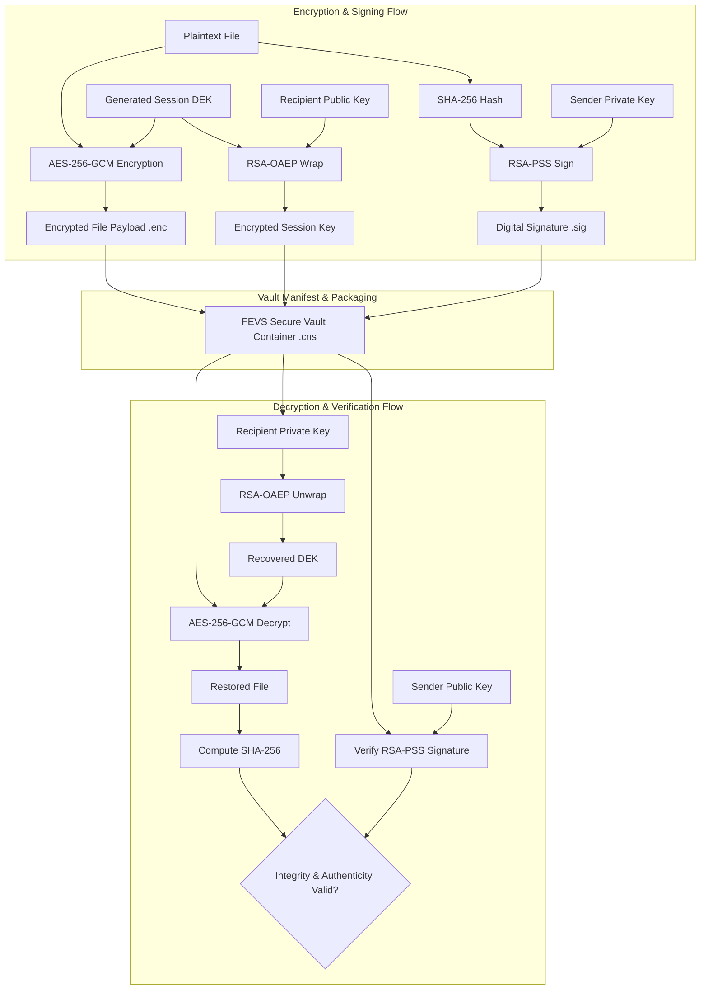

# File Encryption & Verification System (FEVS)

A modular, secure file encryption, digital signature, and integrity verification system implemented in Python, designed as a course project for **Computer & Network Security**.

---

## 📚 Syllabus Alignment: PECE04T / PECE04P — Module 2

This project directly aligns with **Module 2: Cryptographic Techniques** of the **PECE04T (Computer & Network Security)** curriculum and its practical counterpart **PECE04P (Computer & Network Security Lab)**.

| Curriculum Objective | Project Feature / Implementation Mapping | Module Component |
| :--- | :--- | :--- |
| **Symmetric Cryptography** | Authenticated symmetric encryption using **AES-256-GCM**, secure random Initialization Vector (IV) generation, and authentication tag validation. | `src/crypto_symmetric.py` |
| **Asymmetric Cryptography** | Public-key cryptography using **RSA (2048/4096-bit)** with **OAEP padding** for secure key encapsulation and data exchange. | `src/crypto_asymmetric.py` |
| **Data Integrity & Hashing** | Cryptographic hash computation (**SHA-256**) for strict file integrity checks and tamper-detection manifests. | `src/crypto_symmetric.py` / `src/file_vault.py` |
| **Digital Signatures** | Identity validation and non-repudiation using **RSA-PSS** signatures with SHA-256 digests. | `src/crypto_asymmetric.py` |
| **Key Management & Derivation** | Secure key derivation using **PBKDF2-HMAC-SHA256** with high work factor iterations, salt management, and key separation. | `src/crypto_symmetric.py` |
| **Hybrid Encryption Model** | Combination of high-throughput symmetric ciphers for file payloads with asymmetric ciphers for key transport. | `src/file_vault.py` |

---

## 🏛️ Architecture Overview

The system employs a **Hybrid Cryptographic Architecture** to ensure confidentiality, integrity, authenticity, and non-repudiation while maintaining optimal performance for files of arbitrary sizes.



### Modular Components

- **`src/crypto_symmetric.py`**:
  - Implements authenticated symmetric primitives (AES-256-GCM).
  - Handles PBKDF2-based passphrase key derivation and salt management.
  - Implements SHA-256 cryptographic hashing for integrity checks.
- **`src/crypto_asymmetric.py`**:
  - Manages RSA key-pair generation, PEM serialization/deserialization.
  - Implements asymmetric encryption/decryption (RSA-OAEP).
  - Handles digital signature generation and verification (RSA-PSS).
- **`src/file_vault.py`**:
  - Orchestrates hybrid encryption packaging (payload + wrapped DEK + metadata manifest).
  - Coordinates file bundle serialization, extraction, and validation.
- **`src/main.py`**:
  - Command-Line Interface (CLI) entry point providing subcommands for encryption, decryption, signing, verification, and key management.
- **`tests/`**:
  - Comprehensive unit and integration test suite targeting all cryptographic primitives and end-to-end file vault workflows.

---

## 👥 Team Role Distribution

| Member | Primary Role | Assigned Modules & Responsibilities |
| :--- | :--- | :--- |
| **Atharva Tayade** *(Lead)* | System Architect & Integration Lead | • Project architecture design & repository standards<br>• Hybrid vault orchestration (`src/file_vault.py`)<br>• CLI interface & pipeline integration (`src/main.py`) |
| **Team Member 2** | Symmetric Cryptography Specialist | • AES-256-GCM implementation (`src/crypto_symmetric.py`)<br>• PBKDF2 key derivation & salt handling<br>• Symmetric unit testing (`tests/test_symmetric.py`) |
| **Team Member 3** | Asymmetric Cryptography Specialist | • RSA key management & PEM handling (`src/crypto_asymmetric.py`)<br>• RSA-OAEP encryption & RSA-PSS digital signatures<br>• Asymmetric unit testing (`tests/test_asymmetric.py`) |
| **Team Member 4** | Verification, QA & Security Testing | • SHA-256 file integrity verification engine<br>• End-to-end vault integration testing (`tests/test_vault.py`)<br>• Security documentation & test reports |

---

## 📁 Repository Structure

```
File-Encryption-and-Verification-System/
├── .gitignore               # Standard Python gitignore + security artifacts
├── README.md                # Project documentation and syllabus alignment
├── requirements.txt         # Project dependencies (cryptography, pytest)
├── src/
│   ├── __init__.py          # Package initialization
│   ├── crypto_symmetric.py  # Symmetric cipher & hashing primitives
│   ├── crypto_asymmetric.py # Asymmetric cipher & digital signatures
│   ├── file_vault.py        # Hybrid vault orchestrator
│   └── main.py              # CLI entry point
└── tests/
    ├── __init__.py          # Test package initialization
    ├── test_symmetric.py    # Unit tests for symmetric encryption
    ├── test_asymmetric.py   # Unit tests for asymmetric encryption & signatures
    └── test_vault.py        # Integration tests for file vault workflows
```

---

## 🚀 Getting Started

### 1. Prerequisites
- Python 3.10 or higher
- `pip` package manager

### 2. Environment Setup
```bash
# Clone the repository
git clone <repository-url>
cd File-Encryption-and-Verification-System

# Create and activate a virtual environment
python -m venv venv

# On Windows (PowerShell):
.\venv\Scripts\Activate.ps1

# On Linux / macOS:
source venv/bin/activate

# Install dependencies
pip install -r requirements.txt
```

### 3. Running Tests
```bash
pytest
```
