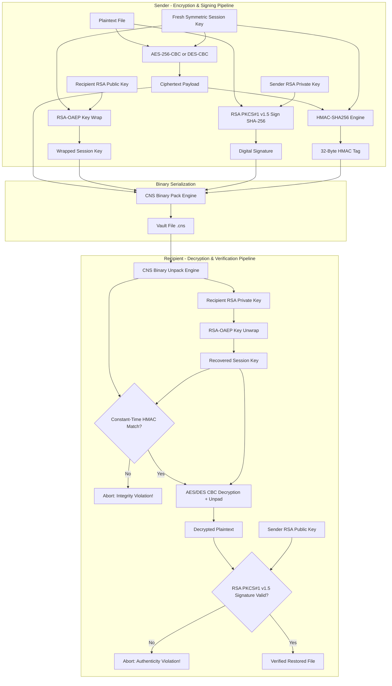

# File Encryption & Verification System (FEVS)

A production-grade, modular file encryption, digital signature, and integrity verification system implemented in Python, designed for the **Computer & Network Security (CNS)** course.

---

## 📚 Syllabus Alignment: PECE04T / PECE04P — Module 2

This system directly implements and benchmarks **Module 2: Cryptographic Techniques** of the **PECE04T (Computer & Network Security)** curriculum and **PECE04P (Computer & Network Security Lab)**.

| Curriculum Objective | Project Feature / Implementation Mapping | Module Component |
| :--- | :--- | :--- |
| **Symmetric Block Ciphers** | **AES-CBC** (256-bit keys, 128-bit blocks) and **DES-CBC** (TripleDES, 64-bit blocks) with standard random IV generation. | [`src/crypto_symmetric.py`](file:///d:/Coding/GitHub/File-Encryption-and-Verification-System/src/crypto_symmetric.py) |
| **Padding Standard** | **PKCS#7 padding and unpadding** with boundary handling and corrupt padding detection. | [`src/crypto_symmetric.py`](file:///d:/Coding/GitHub/File-Encryption-and-Verification-System/src/crypto_symmetric.py) |
| **Asymmetric Cryptography** | **RSA-2048** ($e=65537$) keypair generation, PKCS#8 / SubjectPublicKeyInfo PEM serialization with passphrase protection. | [`src/crypto_asymmetric.py`](file:///d:/Coding/GitHub/File-Encryption-and-Verification-System/src/crypto_asymmetric.py) |
| **Session Key Exchange** | **RSA-OAEP** key wrapping and unwrapping using `MGF1(SHA-256)` and `SHA-256` digest. | [`src/crypto_asymmetric.py`](file:///d:/Coding/GitHub/File-Encryption-and-Verification-System/src/crypto_asymmetric.py) |
| **Digital Signatures** | Identity validation and non-repudiation using **RSA with PKCS#1 v1.5** padding and `SHA-256` digest. | [`src/crypto_asymmetric.py`](file:///d:/Coding/GitHub/File-Encryption-and-Verification-System/src/crypto_asymmetric.py) |
| **Message Authentication** | Constant-time **HMAC-SHA256** integrity tags defending against tampering and timing attacks. | [`src/file_vault.py`](file:///d:/Coding/GitHub/File-Encryption-and-Verification-System/src/file_vault.py) |
| **Binary Packaging** | Custom `.cns` binary container (`b"CNS1"` magic header) packed via Python `struct`. | [`src/file_vault.py`](file:///d:/Coding/GitHub/File-Encryption-and-Verification-System/src/file_vault.py) |
| **Secure Data Sanitization** | Multi-pass cryptographically random overwriting followed by zero-fill flushing before deletion (`shred_file`). | [`src/file_vault.py`](file:///d:/Coding/GitHub/File-Encryption-and-Verification-System/src/file_vault.py) |
| **OpenSSL CLI Interoperability** | Automated cross-verification validating AES-256-CBC ciphertexts and HMAC-SHA256 digests against OpenSSL CLI vectors. | [`scripts/verify_openssl.py`](file:///d:/Coding/GitHub/File-Encryption-and-Verification-System/scripts/verify_openssl.py) |
| **Threat & Trojan Inspection (Module 3)** | Post-decryption magic byte scanner detecting disguised PE/ELF binaries and double-extension attacks. | [`src/security_analyzer.py`](file:///d:/Coding/GitHub/File-Encryption-and-Verification-System/src/security_analyzer.py) |

---

## 🏛️ Architecture Overview

FEVS employs a **Hybrid Cryptographic Architecture** combining the speed of symmetric block ciphers for arbitrary file sizes with the security of asymmetric cryptography for key exchange and non-repudiation.



---

## 📦 `.cns` Binary Container Specification

The `.cns` container is formatted as a packed binary stream with big-endian byte ordering:

| Field | Size | Data Type | Description |
| :--- | :--- | :--- | :--- |
| **Magic Header** | 4 Bytes | `char[4]` | Constant identifier `b"CNS1"` |
| **Cipher Type** | 1 Byte | `uint8` | `0x01` (AES-CBC), `0x02` (DES-CBC) |
| **IV Length** | 1 Byte | `uint8` | Length of IV in bytes (16 for AES, 8 for DES) |
| **IV Data** | Variable | `bytes` | Raw initialization vector |
| **Wrapped Key Length** | 2 Bytes | `uint16` (BE) | Length of wrapped session key (256 for RSA-2048) |
| **Wrapped Key Data** | Variable | `bytes` | RSA-OAEP encrypted session key |
| **HMAC Tag** | 32 Bytes | `bytes` | Fixed 256-bit HMAC-SHA256 authentication tag |
| **Signature Length** | 2 Bytes | `uint16` (BE) | Length of sender's signature (256 for RSA-2048) |
| **Signature Data** | Variable | `bytes` | RSA PKCS#1 v1.5 signature over original plaintext |
| **Ciphertext Data** | Remaining | `bytes` | PKCS#7-padded symmetric ciphertext |

---

## 👥 Team Role Distribution

| Member | Primary Role | Assigned Modules & Responsibilities |
| :--- | :--- | :--- |
| **Atharva Tayade** *(Lead)* | System Architect & Integration Lead | • Project architecture design & repository standards<br>• End-to-end CLI interface & pipeline integration ([`src/main.py`](file:///d:/Coding/GitHub/File-Encryption-and-Verification-System/src/main.py))<br>• OpenSSL interoperability validation ([`scripts/verify_openssl.py`](file:///d:/Coding/GitHub/File-Encryption-and-Verification-System/scripts/verify_openssl.py)) |
| **Team Member 2** | Symmetric Cryptography Specialist | • AES-256-CBC and DES-CBC ciphers ([`src/crypto_symmetric.py`](file:///d:/Coding/GitHub/File-Encryption-and-Verification-System/src/crypto_symmetric.py))<br>• PKCS#7 block padding and unpadding engine<br>• Symmetric unit testing suite ([`tests/test_symmetric.py`](file:///d:/Coding/GitHub/File-Encryption-and-Verification-System/tests/test_symmetric.py)) |
| **Team Member 3** | Asymmetric Cryptography Specialist | • RSA-2048 keypair generation & PEM serialization ([`src/crypto_asymmetric.py`](file:///d:/Coding/GitHub/File-Encryption-and-Verification-System/src/crypto_asymmetric.py))<br>• RSA-OAEP key wrapping & PKCS#1 v1.5 digital signatures<br>• Asymmetric unit testing suite ([`tests/test_asymmetric.py`](file:///d:/Coding/GitHub/File-Encryption-and-Verification-System/tests/test_asymmetric.py)) |
| **Team Member 4** | Vault Serialization & QA Specialist | • `.cns` binary container packing/unpacking ([`src/file_vault.py`](file:///d:/Coding/GitHub/File-Encryption-and-Verification-System/src/file_vault.py))<br>• HMAC-SHA256 integrity checks & multi-pass file shredder<br>• Integration testing suite ([`tests/test_vault.py`](file:///d:/Coding/GitHub/File-Encryption-and-Verification-System/tests/test_vault.py), [`tests/test_integration.py`](file:///d:/Coding/GitHub/File-Encryption-and-Verification-System/tests/test_integration.py)) |

---

## 📁 Repository Structure

```
File-Encryption-and-Verification-System/
├── .gitignore                    # Python bytecode, keys, and security artifacts
├── README.md                     # Complete project documentation and specification
├── requirements.txt              # Dependencies (cryptography, pytest, streamlit)
├── app.py                        # Streamlit Interactive Web GUI Dashboard
├── demo_suite.py                 # Automated 4-Scenario Professor Evaluation CLI Demo
├── scripts/
│   ├── verify_openssl.py         # OpenSSL CLI cryptographic vector cross-verification
│   └── verify_openssl.sh         # Shell script wrapper for OpenSSL validation
├── src/
│   ├── __init__.py               # Package initializer
│   ├── crypto_symmetric.py       # AES-256-CBC, DES-CBC, and PKCS#7 padding
│   ├── crypto_asymmetric.py      # RSA-2048, OAEP wrapping, and PKCS#1 v1.5 signatures
│   ├── file_vault.py             # HMAC-SHA256, .cns packing/unpacking, file shredding
│   ├── security_analyzer.py      # Post-decryption magic byte threat & trojan detector
│   └── main.py                   # Command-line interface (CLI) entry point
└── tests/
    ├── __init__.py               # Test package initializer
    ├── test_symmetric.py         # 46 tests for symmetric ciphers & padding
    ├── test_asymmetric.py        # 14 tests for RSA, key wrapping, and signatures
    ├── test_vault.py             # 14 tests for HMAC, binary layout, and shredding
    ├── test_security_analyzer.py # 9 tests for trojan detection & magic byte analysis
    ├── test_main.py              # 6 tests for CLI argument parsing & error exits
    └── test_integration.py       # 6 tests for multi-party lifecycles & OpenSSL
```

---

## 🚀 Getting Started

### 1. Prerequisites
- **Python**: 3.10 or higher (tested on Python 3.14)
- **OpenSSL**: Version 1.1.1+ or 3.x (optional, for cross-verification)

### 2. Installation & Setup
```bash
# Clone the repository
git clone https://github.com/AtharvaTayade2005/File-Encryption-and-Verification-System.git
cd File-Encryption-and-Verification-System

# Create virtual environment
python -m venv venv

# Activate virtual environment
# Windows (PowerShell):
.\venv\Scripts\Activate.ps1
# Linux / macOS:
source venv/bin/activate

# Install dependencies
pip install -r requirements.txt
```

---

## 🌐 Interactive Web GUI (Streamlit)

FEVS includes an evaluation-ready, interactive web interface to visualize the cryptographic pipeline step-by-step and demonstrate active defense against adversary attacks:

```bash
# Launch the Streamlit Web Application
streamlit run app.py
```

### Web GUI Features:
1. **Interactive RSA Key Manager**: Live key generation, PEM download, and public/private key previews in the sidebar.
2. **Tab 1: Encrypt & Package**: Step-by-step visual breakdown of session key generation, CBC ciphertext preview, RSA digital signature, HMAC-SHA256 authentication tag, and RSA-OAEP key wrapping.
3. **Tab 2: Decrypt & Authenticate**: Live security checklist validating container magic bytes (`b"CNS1"`), key unwrapping, constant-time HMAC check, and digital signature validation.
4. **Tab 3: Attack Simulation & Evaluation Lab**:
   - **Subsection A (Bit-Flip Simulator)**: Injects active 1-bit wire corruption; verifies decryption halts at HMAC check with zero cipher execution.
   - **Subsection B (Identity Forgery)**: Demonstrates rogue key signing and non-repudiation enforcement.
   - **Subsection C (Threat Scanner)**: Post-decryption magic byte inspector flagging disguised executables and trojans.

---

## 🎯 Professor Demonstration & Attack Simulation Suite (`demo_suite.py`)

FEVS includes an automated, color-coded interactive CLI demonstration suite designed specifically for course evaluation and lab vivas:

```bash
# Run the automated 4-scenario demonstration
python demo_suite.py
```

### Demonstration Scenarios Covered:
1. **Scenario 1: The CIA Baseline (Happy Path)**
   - Auto-generates RSA keypairs for Alice and Bob.
   - Encrypts confidential document via AES-256-CBC, computes HMAC-SHA256, signs via RSA-SHA256, wraps key via RSA-OAEP.
   - Decrypts successfully, asserting 100% byte equivalence and non-repudiation.
2. **Scenario 2: Active Adversary / Ciphertext Bit-Flip Attack (Integrity Demo)**
   - Corrupts 1 byte in the ciphertext payload.
   - Decryption immediately halts at the HMAC check before any cipher or unpad operations occur (`[ALERT] Integrity Violation`).
3. **Scenario 3: Man-in-the-Middle / Impostor Sender Attack (Authenticity Demo)**
   - Attacker Eve crafts and signs an unauthorized transfer claiming to be Alice.
   - Bob unwraps and decrypts, but digital signature fails verification against Alice's public key (`[ALERT] RSA Signature Mismatch`).
4. **Scenario 4: Disguised Trojan Payload Attack (Module 3 Threat Demo)**
   - Attacker disguises a Windows PE executable (`b"MZ"`) as `financial_report.pdf`.
   - Post-decryption payload inspection flags: `[CRITICAL DANGEROUS PAYLOAD DETECTED: Trojan/Executable disguised as PDF]`.

---

## 💻 CLI Usage Guide

### 1. Generate RSA Keypairs (`keygen`)
Generate 2048-bit RSA keys for participants:
```bash
# Generate Alice's keys
python src/main.py keygen --out-dir ./keys --prefix alice

# Generate Bob's keys (with optional passphrase protection)
python src/main.py keygen --out-dir ./keys --prefix bob --passphrase "Secret123!"
```
Outputs:
- `./keys/alice_private.pem` & `./keys/alice_public.pem`
- `./keys/bob_private.pem` & `./keys/bob_public.pem`

---

### 2. Encrypt & Sign a File (`encrypt`)
Encrypts a plaintext file with a fresh symmetric session key, signs the plaintext with the sender's private key, computes an HMAC tag, and wraps the key for the recipient:
```bash
# Encrypt using default AES-256-CBC
python src/main.py encrypt \
  --input secret_report.pdf \
  --output vault.cns \
  --recipient-pub ./keys/bob_public.pem \
  --sender-priv ./keys/alice_private.pem

# Encrypt using DES-CBC and shred original input
python src/main.py encrypt \
  --input secret_memo.txt \
  --output vault_des.cns \
  --recipient-pub ./keys/bob_public.pem \
  --sender-priv ./keys/alice_private.pem \
  --cipher des \
  --shred
```

---

### 3. Decrypt & Verify Authenticity (`decrypt`)
Unpacks the `.cns` container, unwraps the session key, verifies the HMAC tag, decrypts the payload, and authenticates the sender's digital signature:
```bash
python src/main.py decrypt \
  --input vault.cns \
  --output restored_report.pdf \
  --recipient-priv ./keys/bob_private.pem \
  --sender-pub ./keys/alice_public.pem \
  --passphrase "Secret123!"
```

**Security Failure Protections:**
- If the ciphertext is altered in transit:
  ```text
  Integrity violation: file has been tampered with!
  ```
- If the signature does not match the sender's public key:
  ```text
  Authenticity violation: signature invalid!
  ```

---

## 🧪 Running Automated Tests

Run the complete test suite (86 passing tests) with `pytest`:

```bash
# Run all tests
pytest

# Run with verbose output
pytest -v

# Run specific test suites
pytest tests/test_symmetric.py
pytest tests/test_asymmetric.py
pytest tests/test_vault.py
pytest tests/test_main.py
pytest tests/test_integration.py
```

---

## 🔍 OpenSSL Vector Verification

Verify that FEVS ciphertexts and HMAC tags match the official OpenSSL CLI:

```bash
# Run the automated cross-verification script
python scripts/verify_openssl.py

# Or on Unix / Git Bash:
bash scripts/verify_openssl.sh
```

### Manual OpenSSL Command Equivalence

To manually decrypt an exported FEVS AES-256-CBC ciphertext using the OpenSSL CLI:
```bash
openssl enc -d -aes-256-cbc \
  -in ciphertext.enc \
  -out decrypted.txt \
  -K <32-byte-hex-key> \
  -iv <16-byte-hex-iv>
```

To manually verify an exported HMAC-SHA256 authentication tag:
```bash
openssl dgst -sha256 \
  -mac HMAC \
  -macopt hexkey:<32-byte-hex-key> \
  ciphertext.enc
```
